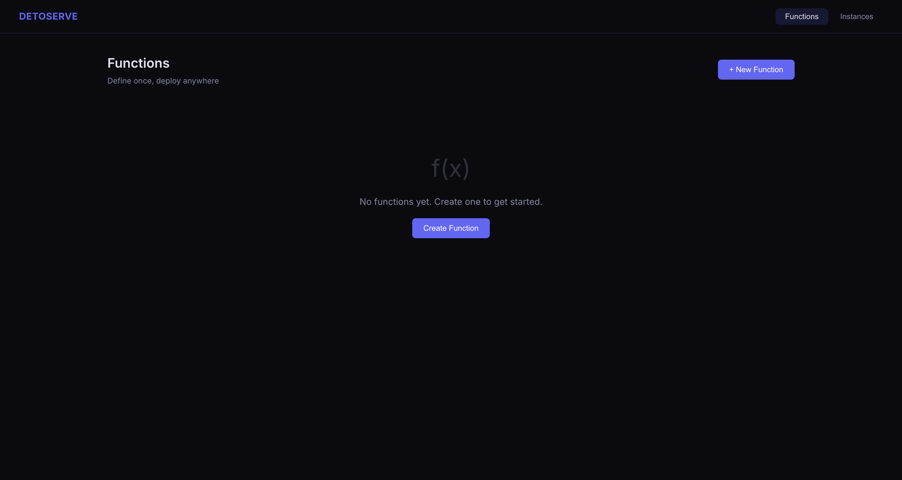
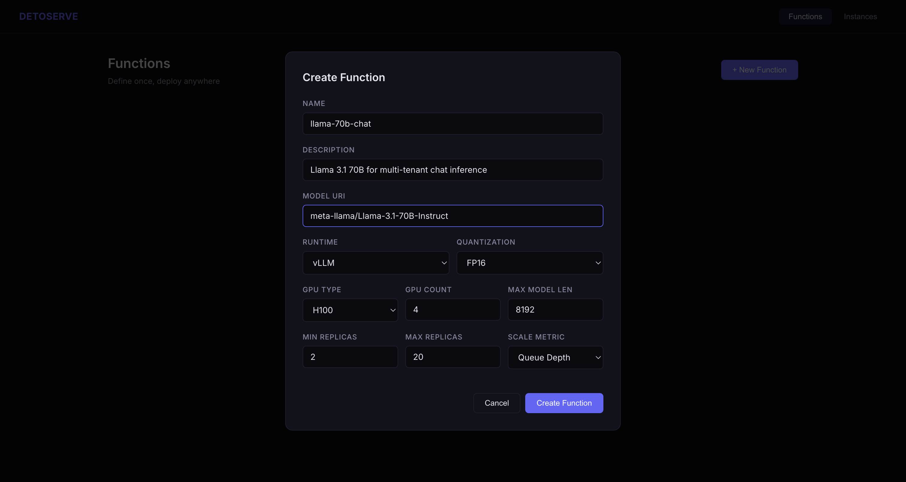
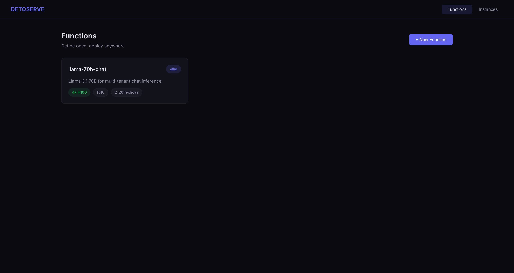
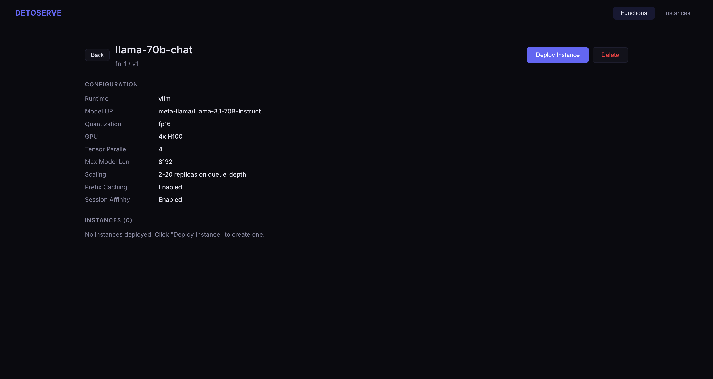
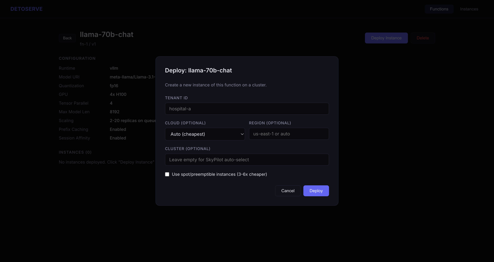
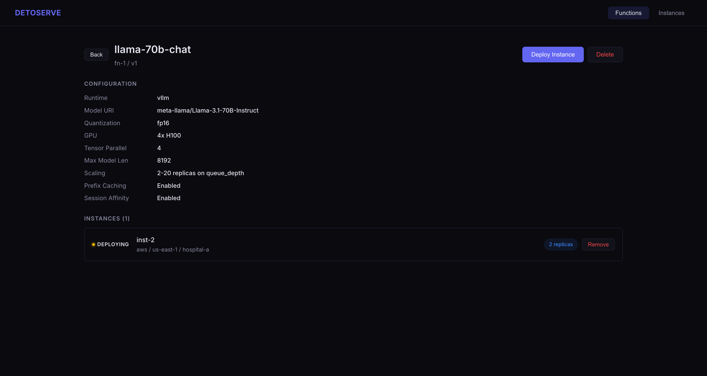
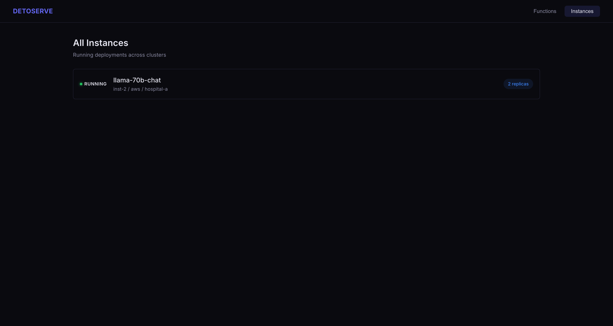
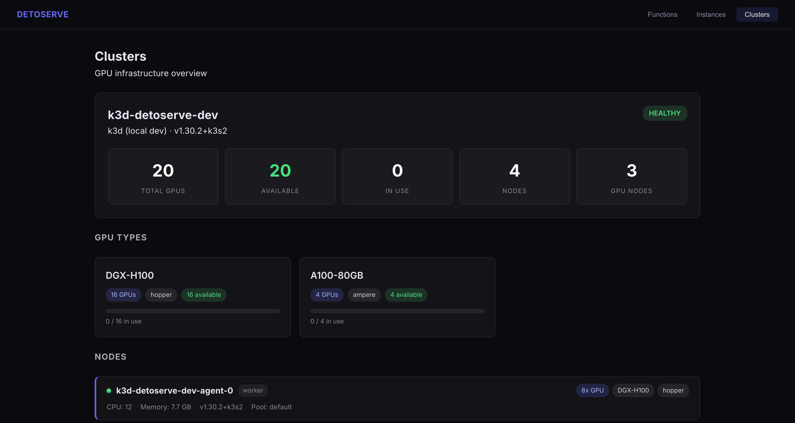
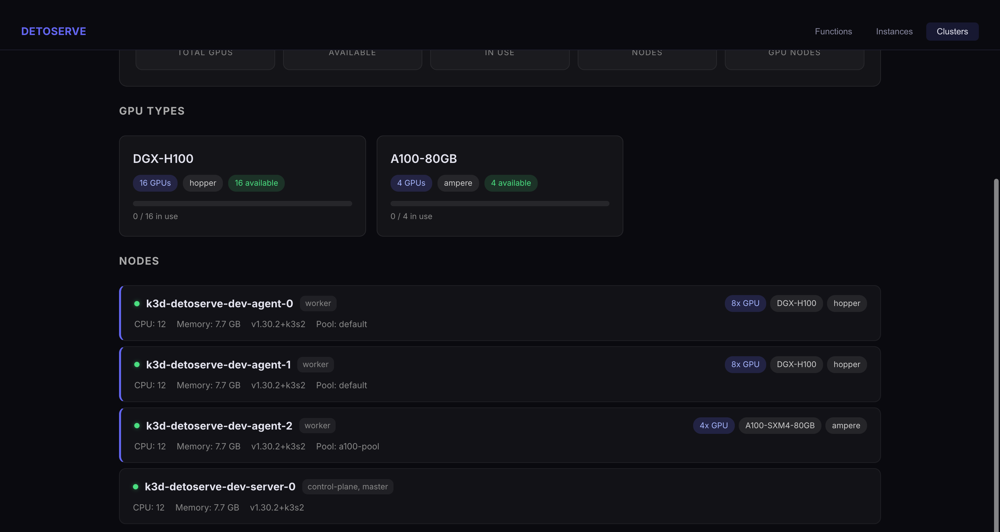

# DetoServe

**Open-source multi-cluster AI inference platform built on [SkyPilot](https://github.com/skypilot-org/skypilot).**

Define inference functions once. Deploy them anywhere — across clouds, on-prem Kubernetes, or BYOC clusters — with KV-cache-aware smart routing, multi-tenancy, and autoscaling.

[](LICENSE)

---

## Why This Exists

Running LLMs in production across multiple clusters is hard. You need:

- **Multi-cluster routing** — send requests to the cluster that already has the KV cache
- **Multi-tenancy** — isolate workloads, quotas, and billing per tenant
- **Function abstraction** — define a model once, deploy it 10 times across regions
- **GPU scheduling** — topology-aware, gang scheduling, hierarchical fairshare
- **One API endpoint** — OpenAI-compatible, regardless of which cluster serves the request

This project provides all of that as an open platform, built on top of proven infrastructure (SkyPilot, KAI Scheduler, vLLM, Envoy).

## Architecture

```
                     Clients / Apps / Agents
                              │
                              ▼
┌────────────────────────────────────────────────────┐
│  Layer 1 — API GATEWAY (Envoy)                     │
│  TLS · Auth · Rate-limit · OpenAI-compatible API   │
└────────────────────┬───────────────────────────────┘
                     │
┌────────────────────▼───────────────────────────────┐
│  Layer 2 — SMART CONTROL PLANE                     │
│                                                    │
│  Smart Router ──── KV Cache Router (Redis)         │
│       │            Session Router (Redis)           │
│       │            Cluster Scorer (load + latency)  │
│       │                                            │
│  Function Manager ── Config Store (GitOps)          │
│  Tenant Manager ──── Metadata (DynamoDB)            │
│  SkyPilot Bridge ─── Deployment Manager             │
└────────────────────┬───────────────────────────────┘
                     │
  ═══════════════════╪═══════════════════════════════
    SkyPilot handles everything below this line
  ═══════════════════╪═══════════════════════════════
                     │
┌────────────────────▼───────────────────────────────┐
│  Layer 3 — SKYPILOT INFRASTRUCTURE                 │
│  sky serve · sky launch · Spot recovery · Pools    │
└────────────────────┬───────────────────────────────┘
                     │
┌────────────────────▼───────────────────────────────┐
│  Layer 4 — GPU CLUSTERS                            │
│  vLLM · Triton · Dynamo/LLM-D · KAI Scheduler     │
│  AWS · GCP · Azure · On-prem K8s · BYOC            │
└────────────────────────────────────────────────────┘
```

## Screenshots

### Functions Dashboard


### Create Function
Define model, runtime, GPU, quantization, and scaling policy in one form.



### Function Card
Each function shows its runtime, GPU config, and scaling at a glance.



### Function Detail & Configuration
Full configuration view with all parameters.



### Deploy Instance
Deploy a function to any cloud, region, or cluster with tenant isolation.



### Instance Status
Track deployment status with live state transitions.



### All Instances
Global view of all running deployments across clusters.



### Clusters Dashboard
Live GPU infrastructure view — discover nodes, GPU types, availability, and utilization.




---

### What SkyPilot Handles vs. What We Build

| Concern | SkyPilot | This Project |
|---------|----------|-------------|
| Cluster provisioning | `sky launch` | — |
| Service deployment | `sky serve` | — |
| Multi-cloud (20+ providers) | Built-in | — |
| Spot recovery | Built-in | — |
| Autoscaling replicas | `sky serve` | — |
| Cost optimization | Automatic | — |
| **KV-cache-aware routing** | — | Smart Router |
| **Session affinity routing** | — | Smart Router |
| **Multi-tenant isolation** | — | Tenant Manager |
| **Function abstraction** | — | Function Manager |
| **GitOps config persistence** | — | Config Store |
| **Unified API gateway** | — | Envoy + ext_proc |
| **GPU scheduling (KAI)** | — | KAI Scheduler integration |

> **DetoServe** = *Deto* (from Depadeto) + *Serve* — serving AI at scale.

## Key Features

- **Functions** — Define a model config once (runtime, GPU, scaling policy), deploy it across any number of clusters/tenants/regions
- **Smart Router** — 4-signal scoring: KV cache locality, session affinity, load headroom, latency
- **Multi-tenancy** — Namespace isolation, per-tenant GPU quotas, rate limits, API keys
- **GitOps** — All function and deployment configs saved to disk (Git-backed), auditable and recoverable
- **KAI Scheduler** — NVIDIA's production-grade GPU scheduler with topology-aware, gang scheduling, hierarchical queues
- **Runtimes** — vLLM, Triton, NVIDIA Dynamo/LLM-D, or custom
- **Frontend UI** — Web dashboard to create functions, deploy instances, monitor status

## Project Structure

```
├── control-plane/
│   ├── smart-router/          # Go — KV-cache-aware request routing
│   ├── function-manager/      # Go — Function CRUD + instance deployment
│   ├── tenant-manager/        # Go — Multi-tenant config, API keys, quotas
│   ├── deployment-manager/    # Go — Orchestrates deployments via SkyPilot Bridge
│   ├── config-store/          # Go — GitOps-compatible config persistence
│   ├── skypilot-bridge/       # Python — REST wrapper around SkyPilot SDK
│   └── api-gateway/           # Envoy Gateway API manifests
├── cluster-agent/             # Go — Cache reporter sidecar for vLLM pods
├── frontend/                  # React — Management UI (Vite)
├── manifests/
│   ├── crds/                  # ModelDeployment CRD
│   ├── gateway/               # K8s manifests: services, KAI, observability, tenant isolation
│   └── examples/              # Example deployments (Llama, Whisper, Dynamo)
├── services/                  # SkyPilot service YAML templates
├── docs/                      # Deep-dive documentation
├── docker-compose.yaml        # Local development environment
└── ARCHITECTURE.md            # Full architecture document
```

## Quick Start

### Prerequisites

- Docker & Docker Compose
- Node.js 18+ (for frontend)
- Go 1.21+ (for control plane services)
- Python 3.10+ (for SkyPilot Bridge)
- [SkyPilot](https://docs.skypilot.co/en/latest/getting-started/installation.html) installed with cloud credentials

### Local Development

```bash
# Clone the repo
git clone https://github.com/YOUR_USERNAME/detoserve.git
cd detoserve

# Start control plane services (Redis, Smart Router, Function Manager, etc.)
docker compose up -d

# Start the frontend
cd frontend
npm install
npm run dev
# → http://localhost:3000

# The UI works in demo mode (in-memory) when backends aren't running
```

### Deploy a Function (via UI)

1. Open `http://localhost:3000`
2. Click **+ New Function**
3. Configure: name, model URI, runtime (vLLM/Triton/Dynamo), GPU type, scaling
4. Click **Create Function**
5. Click into the function → **Deploy Instance**
6. Choose tenant, cloud, region → **Deploy**

### Deploy a Function (via API)

```bash
# Create a function
curl -X POST http://localhost:8086/api/functions \
  -H "Content-Type: application/json" \
  -d '{
    "name": "llama-70b-chat",
    "model_uri": "meta-llama/Llama-3.1-70B-Instruct",
    "runtime": "vllm",
    "gpu_type": "A100",
    "gpu_count": 4,
    "quantization": "fp8",
    "scaling": { "min_replicas": 2, "max_replicas": 20, "metric": "queue_depth" }
  }'

# Deploy an instance
curl -X POST http://localhost:8086/api/functions/fn-1/deploy \
  -H "Content-Type: application/json" \
  -d '{
    "tenant_id": "hospital-a",
    "cloud": "aws",
    "region": "us-east-1"
  }'
```

## Smart Router — How It Works

The Smart Router scores each cluster for every incoming request using 4 weighted signals:

```
Score = (0.35 × KV_cache_hit) + (0.25 × session_pinned) + (0.25 × load_headroom) + (0.15 × latency_score)
```

| Signal | What it checks | Why |
|--------|---------------|-----|
| KV Cache Locality | Does this cluster already hold the prompt's prefix cache? | Avoids re-computing prefill (saves 100s of ms) |
| Session Affinity | Is this user's session pinned to this cluster? | Maintains conversation context |
| Load Headroom | How busy is this cluster? | Prevents overloading |
| Latency | Network latency to this cluster | Minimizes round-trip time |

See [docs/smart-router-deep-dive.md](docs/smart-router-deep-dive.md) for the full algorithm.

## Built With

| Component | Technology | License |
|-----------|-----------|---------|
| Infrastructure | [SkyPilot](https://github.com/skypilot-org/skypilot) | Apache 2.0 |
| GPU Scheduling | [KAI Scheduler](https://github.com/NVIDIA/KAI-Scheduler) | Apache 2.0 |
| Inference Engine | [vLLM](https://github.com/vllm-project/vllm) | Apache 2.0 |
| API Gateway | [Envoy Proxy](https://github.com/envoyproxy/envoy) | Apache 2.0 |
| Control Plane | Go (Fiber) | MIT |
| Frontend | React (Vite) | MIT |
| Cache/Sessions | Redis | BSD 3-Clause |

## Roadmap

- [ ] Phase 1 — Core platform (Smart Router, Function Manager, Tenant Manager) ← **current**
- [ ] Phase 2 — Production KAI Scheduler integration with hierarchical queues
- [ ] Phase 3 — NVIDIA Dynamo/LLM-D disaggregated prefill/decode
- [ ] Phase 4 — Semantic routing (route by prompt intent to optimal model)
- [ ] Phase 5 — Cost dashboard and per-tenant billing
- [ ] Phase 6 — Federated learning and model fine-tuning pipelines

## Contributing

We welcome contributions! See [CONTRIBUTING.md](CONTRIBUTING.md) for guidelines.

Areas where help is especially welcome:
- Smart Router scoring algorithm improvements
- Additional inference runtime integrations
- KAI Scheduler queue policy templates
- Frontend UI enhancements
- Documentation and tutorials
- Testing and CI/CD pipelines

## License

This project is licensed under the Apache License 2.0 — see [LICENSE](LICENSE) for details.
